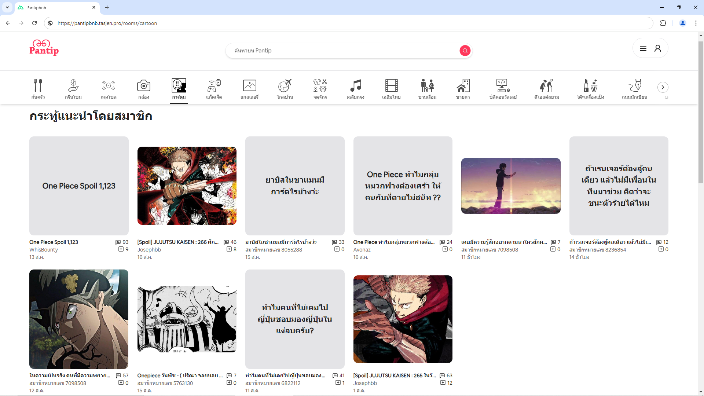

# Pantipbnb




# Disclaimer

This project is an educational exercise to improve my frontend development skills. It is not intended for commercial use or public deployment due to potential copyright issues related to the original websites' design, branding, and content. To avoid any legal risks, I decided to cancel the public deployment of this project.

# Try it locally

You can easily try out the application by following these steps:

1\. Clone this repo

```
git clone https://github.com/tasjen/pantipbnb.git
```

2\. Install dependencies

```
npm install
```

3\. Start a development server

```
npm run dev
```

&nbsp;&nbsp;&nbsp;&nbsp;or start a production server

```
npm run build && npm run preview
```

4\. Visit http://localhost:3000
